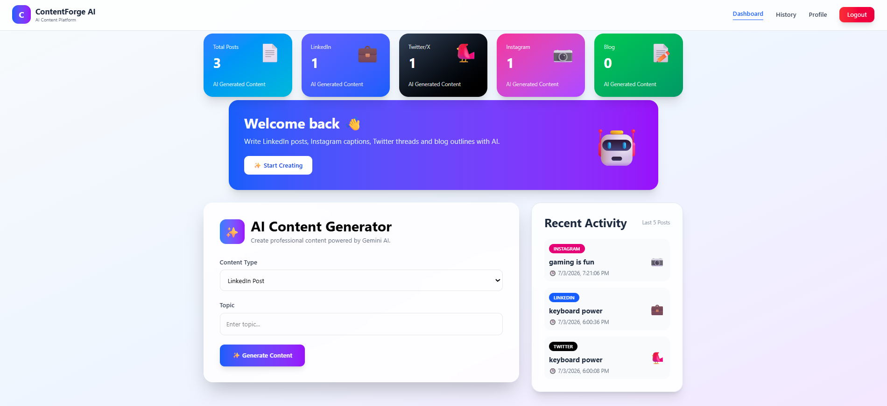
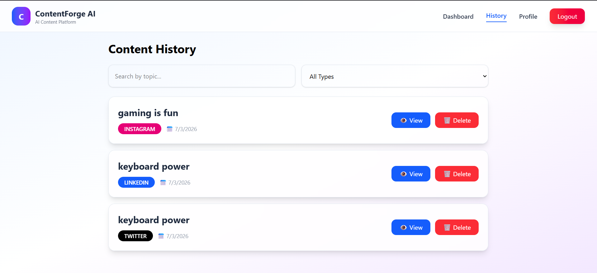
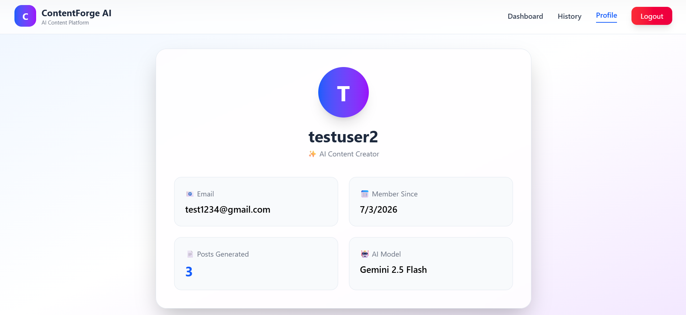
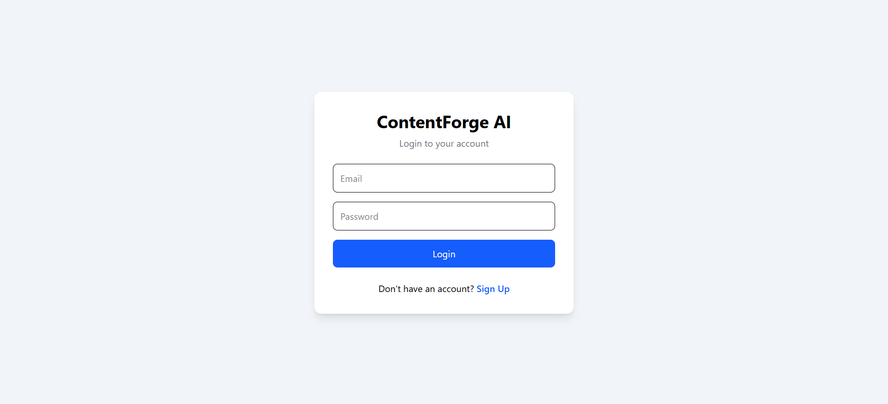
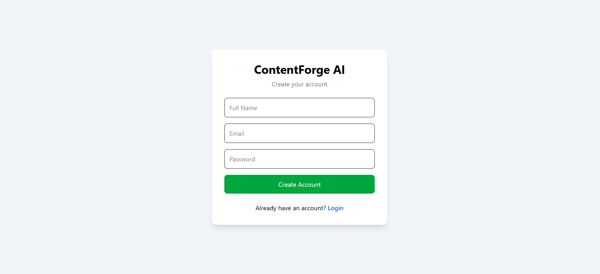

# 🤖 ContentForge AI

An AI-powered content generation platform built with **React**, **FastAPI**, **MongoDB**, and **Google Gemini AI**. Generate high-quality content for LinkedIn, Twitter/X, Instagram, and Blogs in seconds with an intuitive and modern dashboard.

---

## 🚀 Features

### 🔐 Authentication
- User Signup & Login
- JWT Authentication
- Protected Routes
- Secure Password Hashing

### 🤖 AI Content Generation
- LinkedIn Post Generator
- Twitter/X Post Generator
- Instagram Caption Generator
- Blog Outline Generator
- AI Rewrite with Different Tones
- Powered by Google Gemini AI

### 📊 Dashboard
- Analytics Cards
- Recent Activity
- Quick Content Generation
- Modern Responsive UI

### 📚 Content History
- View Previous Content
- Search by Topic
- Filter by Content Type
- Delete Generated Content

### 👤 User Profile
- Profile Information
- Member Since
- Total Posts Generated
- AI Model Information

### 📄 Export
- Download Content as TXT
- Download Content as PDF

---

# 🛠 Tech Stack

## Frontend
- React.js
- Vite
- Tailwind CSS
- React Router
- Axios

## Backend
- FastAPI
- Python
- MongoDB Atlas
- PyMongo
- JWT Authentication
- Google Gemini AI

---

# 📂 Project Structure

```
ContentForge-AI
│
├── backend
│   ├── routes
│   ├── utils
│   ├── models
│   ├── database.py
│   └── main.py
│
├── frontend
│   ├── src
│   │   ├── components
│   │   ├── pages
│   │   ├── context
│   │   └── api
│   └── public
│
├── screenshots
│
└── README.md
```

---

# 📸 Screenshots

## Dashboard



---

## History



---

## Profile



---

## Login



---

## Signup



---

# ⚙️ Installation

## Clone the repository

```bash
git clone https://github.com/HemangBagadi/ContentForge-AI.git
```

Go into the project folder

```bash
cd ContentForge-AI
```

---

## Backend Setup

```bash
cd backend
```

Create a virtual environment

```bash
python -m venv venv
```

Activate it

Windows

```bash
venv\Scripts\activate
```

Install dependencies

```bash
pip install -r requirements.txt
```

Run the backend

```bash
uvicorn main:app --reload
```

---

## Frontend Setup

```bash
cd frontend
```

Install dependencies

```bash
npm install
```

Run the frontend

```bash
npm run dev
```

---

# 🌟 Future Improvements

- Dark Mode
- Email Verification
- AI Image Generation
- More AI Models
- Team Collaboration
- Social Media Scheduling

---

# 👨‍💻 Author

**Hemang Bagadi**

GitHub:
https://github.com/HemangBagadi

---

# ⭐ Support

If you like this project, consider giving it a ⭐ on GitHub!